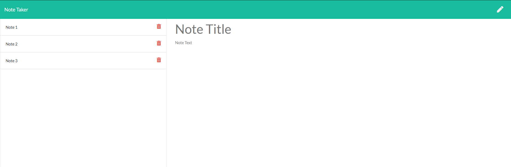

# Note Taker Starter Code
  

  ## Description
  Note taker can be used to write and save notes. This application used an Express.js back end and will save and retrieve note data from a JSON file.  

  * Link for Heroku Deployment [Heroku](https://weekly-challenge11-note-taker.herokuapp.com/)    
  * Link for GitHub Repository [GitHub](https://github.com/a7063p/week-11-challenge.git)  

  ## Table of Contents
  * [Installation](#Installation)
  * [Usage](#Usage)
  * [License](#License)
  * [Languages](#Languages)  
  
  
  * [Questions](##Questions) 
  

  ## Installation
  This application has been deployed to Heroku please use the [Heroku](https://weekly-challenge11-note-taker.herokuapp.com/) link for deployment

  ## Usage
  Upon opening the application presented with a landing page with a link to a notes page. When you click on the "Get Started" button you will be presented with a page with existing notes listed in the left-hand column, plus empty fields to enter a new note title and the note’s text in the right-hand column. 

  When you enter a note title AND not text a SAVE Icon will appear in the upper right nav bar. When selecting "Save" your not will be saved and appear in the left-side column.

  When you want to view the note in its entirety, click on the text in the left hand column and the note will appear in the right6 column.

    
  
  ## Languages  
        
          
 

  ## License
  
  
  This application currently is licensed with MIT. 
 

  

  ## Contribute
  Contrbutor privileges are open to ALL that want to positively contribute to this project

  
  

  ## Questions
  Please feel free to email me with any comments, questions or concerns at ap@ampiUSA.com

  [GitHub Account](https://github.com/a7063p)

